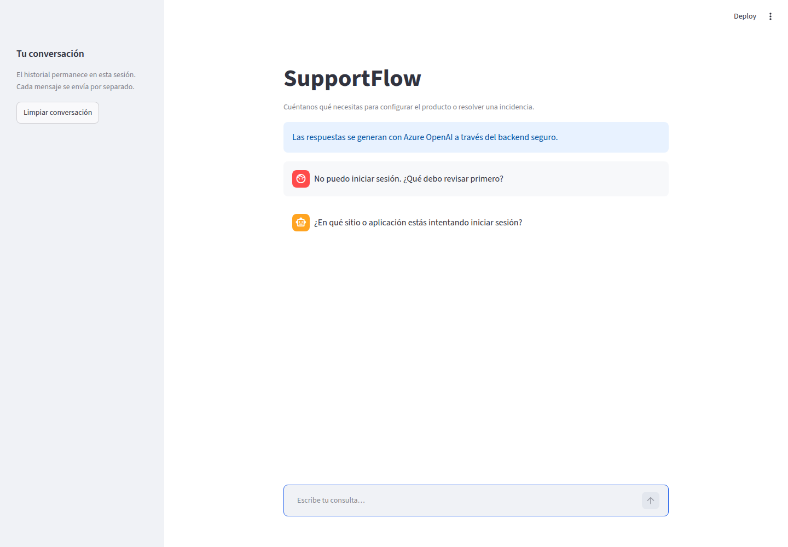

# SupportFlow — chat de soporte técnico

**Estado actual: Streamlit y FastAPI conectados con Azure OpenAI.** El backend valida cada mensaje y usa el despliegue configurado en Microsoft Foundry para generar una respuesta de soporte.

SupportFlow es un proyecto de portafolio basado en el [diagrama de referencia](docs/design.png). Implementa el canal de interfaces, la recepción de solicitudes y la conexión con un modelo alojado en Azure. La clasificación estructurada, memoria, RAG, herramientas y despliegue público son trabajo futuro.



## Ejecutar localmente

Requisitos: Python 3.14, [uv](https://docs.astral.sh/uv/) y una sesión de Azure CLI con acceso al modelo. Inicia sesión antes de arrancar el proyecto:

```bash
az login
```

Desde la raíz del proyecto, un solo script instala las dependencias bloqueadas e inicia ambos servicios:

```bash
./run.sh
```

Abre el chat en **http://127.0.0.1:8510**. La documentación interactiva de la API está en **http://127.0.0.1:8010/docs** y su estado en **http://127.0.0.1:8010/health**. `Ctrl+C` detiene ambos procesos.

El script ofrece estas operaciones:

```bash
./run.sh start     # iniciar; "./run.sh" hace lo mismo
./run.sh restart   # detener e iniciar de nuevo
./run.sh stop      # detener ambos servicios
./run.sh --help    # mostrar ayuda
```

Solo permite una ejecución simultánea del proyecto y elimina sus archivos PID cuando se detiene.

El script usa `8010` para FastAPI y `8510` para Streamlit. Para elegir otros puertos sin editar archivos:

```bash
SUPPORTFLOW_BACKEND_PORT=9010 SUPPORTFLOW_FRONTEND_PORT=9510 ./run.sh
```

También puedes ejecutar los servicios manualmente en dos terminales:

```bash
uv run uvicorn supportflow.main:app --host 127.0.0.1 --port 8010 --workers 1 --no-proxy-headers --no-access-log
```

```bash
uv run streamlit run streamlit_app.py
```

Escribe «No puedo iniciar sesión desde ayer». Verás una respuesta generada por Azure OpenAI. «Limpiar conversación» borra el historial de esa sesión. Cada envío procesa únicamente el texto nuevo; el backend no usa el historial ni guarda mensajes.

## Arquitectura

El diagrama editable está en [docs/arquitectura-actual.mmd](docs/arquitectura-actual.mmd). La versión SVG incluye los iconos de cada tecnología:



Para volver a generar el SVG con Mermaid CLI:

```bash
mmdc -i docs/arquitectura-actual.mmd \
  -o docs/arquitectura-actual.svg
```

Los iconos se cargan mediante URLs SVG públicas de Iconify y Simple Icons, por lo que también aparecen en Mermaid.ai sin registrar paquetes manualmente.

Para imprimir la arquitectura en dos hojas A4 horizontales, usa el [PDF preparado para impresión](docs/arquitectura-a4.pdf). También están disponibles los HTML imprimibles de la [hoja 1](docs/arquitectura-a4/hoja-1.html) y la [hoja 2](docs/arquitectura-a4/hoja-2.html), junto con sus archivos Mermaid editables: [MMD 1](docs/arquitectura-a4/hoja-1.mmd) y [MMD 2](docs/arquitectura-a4/hoja-2.mmd).

Streamlit llama a FastAPI mediante HTTPX. El backend valida el mensaje, crea el contexto seguro y llama a Azure OpenAI con la Responses API v1. La autenticación predeterminada usa Microsoft Entra ID: Azure CLI durante el desarrollo y Managed Identity al alojar la aplicación en Azure. El historial visual se mantiene en `st.session_state`, separado por sesión y sin persistencia.

## Configuración

Las variables de `.env` se validan al iniciar. El archivo `.env.example` contiene los valores predeterminados y no contiene secretos.

| Variable | Predeterminado | Uso |
| --- | --- | --- |
| `SUPPORTFLOW_API_URL` | `http://127.0.0.1:8010` | URL del backend para Streamlit |
| `SUPPORTFLOW_HTTP_TIMEOUT_SECONDS` | `40` | Plazo de Streamlit para esperar la respuesta del backend |
| `SUPPORTFLOW_MAX_BODY_BYTES` | `16384` | Máximo del cuerpo recibido antes de parsear JSON |
| `SUPPORTFLOW_RATE_LIMIT` | `10` | Solicitudes por IP dentro de la ventana |
| `SUPPORTFLOW_RATE_WINDOW_SECONDS` | `60` | Duración de la ventana deslizante |
| `SUPPORTFLOW_AZURE_OPENAI_ENABLED` | `false` | Activa las respuestas generadas con Azure OpenAI |
| `SUPPORTFLOW_AZURE_OPENAI_ENDPOINT` | — | Endpoint HTTPS del recurso de Azure AI |
| `SUPPORTFLOW_AZURE_OPENAI_DEPLOYMENT` | — | Nombre del despliegue del modelo |
| `SUPPORTFLOW_AZURE_OPENAI_AUTH` | `entra` | Autenticación: `entra` o `api_key` |
| `SUPPORTFLOW_AZURE_OPENAI_API_KEY` | — | Clave opcional para `api_key`; nunca se versiona |
| `SUPPORTFLOW_AZURE_OPENAI_TIMEOUT_SECONDS` | `30` | Límite de la llamada del backend al modelo |
| `SUPPORTFLOW_AZURE_OPENAI_MAX_OUTPUT_TOKENS` | `512` | Máximo de tokens de salida, incluido el razonamiento |

La configuración local ya apunta al recurso `rag-manual-foundry-resource` y al despliegue `rag-manual-generico-dev-general`. No contiene claves: `DefaultAzureCredential` toma la identidad iniciada con Azure CLI. Para otra instalación, copia `.env.example` a `.env`, completa endpoint y despliegue y activa `SUPPORTFLOW_AZURE_OPENAI_ENABLED`.

El máximo del mensaje es 4.000 caracteres después de normalizarlo. Los cuerpos JSON escapados también cuentan para el límite de bytes. Las solicitudes inválidas consumen cuota. El limitador vive en memoria y se reinicia al reiniciar el backend; todos los usuarios del servidor Streamlit comparten su IP. Esta configuración corresponde a una demo local con un único proceso.

## API

```bash
curl -i http://127.0.0.1:8010/api/agent/messages \
  -H 'Content-Type: application/json' \
  --data '{"message":"No puedo iniciar sesión desde ayer.","locale_hint":"es"}'
```

Respuesta HTTP `200` ilustrativa; identificador y fecha se generan para cada petición:

```json
{
  "request_id": "01ecf7d9-f22d-4f8d-bbdd-60ef64a336d2",
  "status": "answered",
  "received_at": "2026-09-14T20:00:00Z",
  "user_message": "Prueba restablecer tu contraseña y confirma el mensaje de error que aparece."
}
```

`answered` indica que Azure OpenAI completó la respuesta durante la petición. No significa que se creó un ticket ni que se guardó o encoló el mensaje. Si Azure está deshabilitado, el modo local conserva `received` y devuelve una confirmación fija. Las respuestas admiten `es`, `en` y `pt`; la interfaz está en español.

La API solo acepta solicitudes anónimas. Una cabecera `Authorization`, incluso vacía, produce `401`; no hay autenticación real ni lectura de tickets. El cliente no puede declarar identidad, permisos, canal, fecha ni identificador. Las respuestas incluyen `X-Request-ID` y `Cache-Control: no-store`.

## Verificación

```bash
uv run pytest -q
uv run ruff check .
uv run ruff format --check .
```

Las pruebas cubren contratos, normalización, entrada inválida, cuerpos fragmentados, cuota y recuperación de la ventana, registros sin contenido, fallos del cliente y comportamiento del chat con AppTest. La integración automatizada conecta el chat con FastAPI mediante un transporte de prueba; las instrucciones anteriores permiten probar ambos procesos reales.

Verificación realizada el 2026-09-14: **83 pruebas pasaron**, Ruff aprobó el código y el formato, y una petición HTTP real recibió una respuesta `answered` del despliegue de Azure. FastAPI está en `8010` y Streamlit en `8510`.

El backend emite registros JSON con identificador, resultado, estado HTTP y duración. Los comandos desactivan el registro de acceso de Uvicorn para mantener los registros en ese formato; no se registran mensajes ni credenciales.

## Documentación y próximos hitos

- [Contrato de API vigente](docs/contrato-api.md).
- [Diseño de recepción y futura clasificación](docs/diseno-pasos-1-2.md).
- [Estado de implementación y trabajo pendiente](docs/plan-implementacion.md).

La siguiente etapa añadirá controles de contenido, clasificación validada y políticas deterministas en el servidor. La conexión actual genera texto con Azure OpenAI, pero todavía no usa RAG, herramientas ni memoria persistente y no dispone de métricas formales de calidad.
